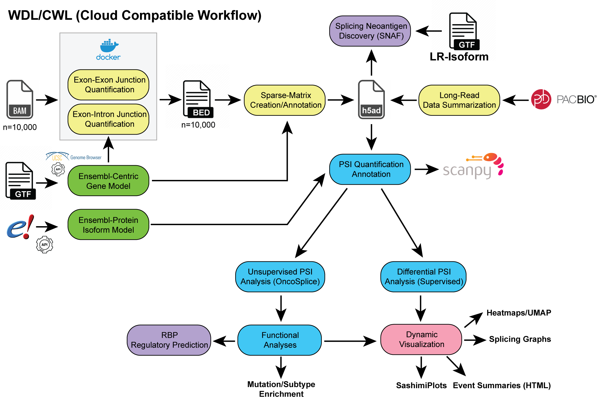

[](https://altanalyze3.readthedocs.io/en/latest/?badge=latest)  [](https://pypi.org/project/altanalyze3/)  [](https://pypi.org/project/altanalyze3/)  [](https://github.com/SalomonisLab/altanalyze3/stargazers)


# AltAnalyze 3
AltAnalyze3 is an advanced Python3 workflow for long-read (LR) and short read splicing analysis. The software can integrate results across single-cell and bulk technological platforms, aligning to a common gene model for splice junction- (MultiPath-PSI) and isoform-based analyses (TPM or ratio). Both supervised and unsupervised (splice-ICGS) analyses are supported. Workflows can be run in a fully automated manner with or step-by-step with extensive customization. See tutorials for examples or the [https://altanalyze.org](https://altanalyze.org).



## Tutorials and Installation

[Read the full documentation](https://altanalyze3.readthedocs.io/en/latest/). AltAnalyze 3 has been tested in python>=3.11 on MacOS and Linux. To install:

```bash
pip install AltAnalyze3
```

The source code is in [src folder](./src)

The documentation is in [doc folder](./doc)

The testing examples and code are in [test folder](./test)

## Contribution rules

If you are a member of the development team, to contribute, please follow the steps below:

```bash
# if you haven't cloned before
git clone https://github.com/SalomonisLab/altanalyze3.git
git checkout -b <your_branch_name>  # please replace "frank" with your token
# if you already have the local repository
git checkout main
git pull origin main
# do the same things for your branch as well
git checkout <your_branch_name>
git pull origina <your_branch_name>
# then make the changes in your branch locally, after finished, push them to the correpsonding branch on GitHub
git push origin HEAD:<your_branch_name>
```

Then, on the GitHub, go to your branch, and click contribute, issue a pull request with clear messages on what you have changed. Then the managers will review your pull requests and deciding whether to merge to the main branch or not (At each standing meeting).

If you are not a member of development team, to contribute, please follow the steps below:

1. fork the repository to your account
2. make the changes in your forked repository
3. create a pull request
4. the managers will review your codes and decide how to merge into the main branch (At each standing meeting)

## To cite AltAnalyze3 please refer to the following publication

- [Splicing regulatory dynamics for precision analysis and treatment of heterogeneous leukemias.](https://pubmed.ncbi.nlm.nih.gov/40333990/) Venkatasubramanian M, Schwartz L, Ramachandra N, Bennett J, Subramanian KR, Chen X, Gordon-Mitchell S, Fromowitz A, Pradhan K, Shechter D, Sahu S, Heiser D, Scherle P, Chetal K, Kulkarni A, Lee D, Zhou J, Myers KC, Tseng E, Weirauch MT, Grimes HL, Starczynowski DT, Verma A, Salomonis N. *Sci Transl Med.* 2025 May 7;17(797):eadr1471. doi: 10.1126/scitranslmed.adr1471. PMID: 40333990.
