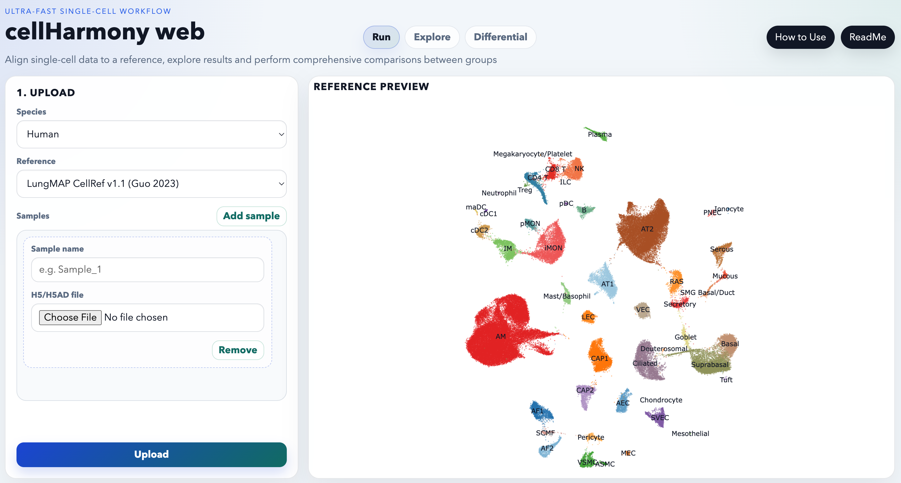

# How to Use cellHarmony web

This guide describes the current `cellHarmony web` interface after the explorer
promotion. The app is organized into `Run`, `Explore`, and `Differential`
tabs.

Full walkthrough video covering upload, QC, ambient correction, plot
exploration, DEG analysis, and interface interactivity:

[Watch the full cellHarmony-web walkthrough on Vimeo](https://vimeo.com/manage/videos/1183088658/01170fe26e)

[](https://vimeo.com/manage/videos/1183088658/01170fe26e)

Additional detailed documentation:

- [cellHarmony technology and workflow details](https://github.com/SalomonisLab/altanalyze3/blob/master/docs/cellHarmony.md)
- [cellHarmony-differential methods, defaults, and filtering details](https://github.com/SalomonisLab/altanalyze3/blob/master/docs/cellHarmony_differential.md)

These documents include more detail on the underlying technologies used,
statistical filtering defaults, and implementation-specific behavior.

## What the app does

`cellHarmony web` is used to:

1. align single-cell data to a reference atlas
2. inspect aligned cell states and gene expression interactively
3. compare biological groups within aligned cell states

## What you can upload

Accepted file types:

- `.h5`
- `.h5ad`

Recommended interpretation:

- upload one file per biological sample
- use matching species and one shared reference atlas per job

Important input behavior:

- multiple `.h5` files support grouped differential analysis
- a single `.h5ad` can also support grouped differential analysis when its
  `.obs` metadata contain reusable biological grouping fields
- a single `.h5` upload does not enable grouped differential analysis

When `.h5ad` files are uploaded, compatible `.obs` metadata are retained and
later reused in:

- Explore filters
- Differential cell-state selection
- Differential biological-group selection

## Run tab

The `Run` tab contains the upload and QC/alignment workflow.

### Before upload

You can:

- choose `Species`
- choose `Reference`
- inspect the reference preview
- add one or more sample rows

Each sample row includes:

- `Sample name`
- `.h5` or `.h5ad` file selection

### Upload

Click `Upload` after all sample rows are prepared.

What happens:

- files are copied into a new job directory
- a job ID is assigned
- QC/alignment controls become available in the same Run tab

### QC and alignment

Available settings:

- `Min genes`
- `Min counts`
- `Min cells`
- `Mito %`
- `Minimum cosine similarity score`
- `Ambient RNA correction`
  - `No`
  - `Yes`

`Ambient RNA correction` controls whether automatic per-sample ambient RNA
estimation and subtraction are run before alignment. Select `No` to skip this
step or `Yes` to enable automatic ambient correction. Users should review their
data for ambient RNA contamination and enable correction when appropriate. For
many standard droplet RNA datasets, ambient correction values near `20%` are a
reasonable expectation, though higher contamination can occur in some assay
types.

Then click `Save QC and run`.

What happens during alignment:

1. files are loaded
2. cells are filtered by QC
3. data are normalized
4. cells are aligned to the selected reference
5. low-alignment cells are excluded using the cosine cutoff
6. markerFinder and marker network analysis are run by default
7. approximate UMAP placement is computed
8. the combined aligned h5ad is written

While it runs, the app shows:

- a progress bar
- QC counts
- pipeline log output

When alignment finishes:

- the app switches to `Explore`
- gene suggestions become available
- Explore downloads become active
- Differential becomes usable when the job supports grouped comparison

## Marker analysis

Marker analysis is always run:

- markerFinder is run on the aligned dataset
- the app exports a marker heatmap PDF and TSVs
- the app exports redundant top-ranked marker tables for network generation
- NetPerspective networks are generated for marker-defined cell states
- a marker ZIP archive becomes available in Explore

This marker analysis is run after alignment and before final result browsing.

## Explore tab

The Explore tab is the main aligned-data workspace. It remains available even
after differential analysis is run.

The left column contains:

- `Dot size`
- `Filter data to display`
- Explore downloads

The right side contains two viewers:

- `Approximate UMAP`
- `Expression`

### Filter data to display

These filters restrict the cells shown in the Explore viewers.

Available controls:

- `Annotation 1`
- `Values`
- optionally `Annotation 2`
- optionally second `Values`

These filters affect only visualization. They do not rerun alignment or modify
saved outputs.

### Approximate UMAP

The Approximate UMAP viewer supports:

- `UMAP broad`
- `UMAP cell types`
- `Cell frequency`

Notes:

- `UMAP broad` overlays aligned query cells relative to the reference context
- `UMAP cell types` colors cells by aligned population
- `Cell frequency` summarizes normalized fractions per sample using only the
  currently filtered cells
- aligned cell-type colors are kept consistent with the reference preview color
  scheme

The `Download PDF` button exports the current Approximate UMAP mode.

### Expression

The Expression viewer contains:

- `Select gene`
- `Select plot type`
- optional `Marker cell state`

Supported plot types:

- `UMAP`
- `Violin`
- `MarkerHeatmap` when marker outputs exist
- `MarkerNetwork` when marker networks exist

Behavior:

- `UMAP` colors cells by expression of the selected gene
- zero-expression cells remain in the background
- `Violin` shows all cells as dots
- `MarkerHeatmap` opens the exported marker matrix in an embedded Morpheus view
- `MarkerNetwork` shows the exported marker network for one marker-defined cell
  state
- `Marker cell state` appears only when `MarkerNetwork` is selected

The `Download PDF` button exports the current Expression mode. For
`MarkerHeatmap`, the exported PDF is the saved marker heatmap PDF.

### Explore downloads

Available downloads may include:

- `Download assignments`
- `Download combined_h5ad`
- `Download marker genes ZIP`

Notes:

- assignments include appended UMAP coordinates
- the combined h5ad contains the aligned dataset and approximate UMAP results
- marker ZIP appears after the default marker analysis completes

## Differential tab

The Differential tab is for comparisons between biological groups.

It is enabled only when:

- two or more samples were uploaded for the job, or
- one `.h5ad` contains multiple biological groups in compatible `.obs`
  metadata

If that condition is not met, the tab shows a warning instead of the
differential workflow.

### Differential setup

Controls include:

- `Cell-state aligned to`
- `Group values from`
- `Comparison Type`
  - `cells`
  - `pseudobulk`
- `Group 1 (numerator)`
- `Group 2 (denominator)`

Behavior:

- `Cell-state aligned to` chooses the annotation field used as the differential
  population axis
- `Group values from` chooses the biological grouping field
- `Group 1` and `Group 2` select the values to compare

### Differential results

The left result viewer supports:

- `Heatmap`
- `Volcano`
- `Network`
- `GO Terms`

The right result viewer is:

- `Gene Detail`

Behavior:

- selecting a gene from the left viewer updates Gene Detail
- the Differential tab stays active while the differential job runs
- after differential completes, Explore remains available and keeps its own
  aligned-data plots

The Differential tab also provides:

- a differential ZIP download
- PDF export for the active left differential view
- PDF export for the selected Gene Detail plot

## Resetting the interface

After a dataset has been uploaded, a `Reset data` button appears in the header.

This resets the interface without a manual browser reload and returns the app
to a fresh pre-upload state.

## Local run

From the repo root:

```bash
uvicorn altanalyze3.components.cellHarmony.webapp.app:app --reload
```

Open:

```text
http://127.0.0.1:8000
```
