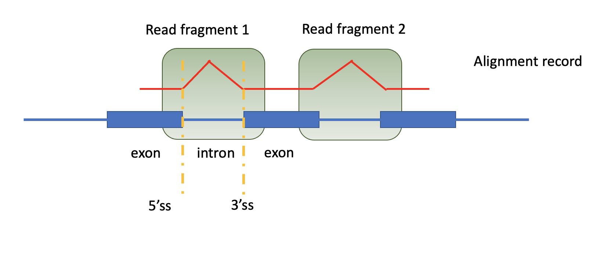

# Development guide

## Input

1. A bam file sorted by `chr` and `pos`.
2. ExonReference File (See [here](./exonReference.csv))


## Program

1. Iterating each alignment record in bam file, we only look at record whose cigar string contains "N" (Here we don't consider soft clip, hard clip or padded alignment scenarios). The "N" indicates this alignment record spans at least one intron, which supports the existence of a junction.

2. Programatically, a junction is uniquely defined by four elements: `(chromosome, 5' splice site position, 3' splice site position, strand)`. As an exmaple, (chr1,45666,45789,+). A junction can have multiple supportive reads, as long as the read spans this junction. So we create a dictionary-like object `junction_db` where the key is a tuple (4 elements defining a junction), and the values are all the reads that can support this junction (a list). Again, let's illustrate that using an example:

```python
# junction1 

key: (chr1,45666,45789,+)
value: [(read1_start_pos, read1_start_pos + read1_length, read1_intron_length),
(read2_start_pos, read2_start_pos + read2_length, read2_intron_length),
...]

```

Noting that an alignment record in the bam file, can contain multiple reads (See image below, this alignment record contains 2 reads), and this definision is just for illustrative purpose, it is not generic across the whole field.

So the end goal through this iteration is to generate this `junction_db`. In each alignment record, we further iterate over the reads it may contains (like I said, a record can contain multiple reads), we retrived (a) junction this read spans along with the four essential information that can define this junction, (b) the start position, read length, and intron length of the read.



3. After having this `junction_db`, we are going to write them to a bed file. See example output [Here](junction_bed.csv). (**How does the junction definition (4 infomation) transform to the bed file? Need to chat with Nathan**)


4. Additionally, we identify the intron retention event. This is a new round of iteration through all the alignment records in the bam file. The definition of the intron comes from the exonReference file (**Still need to be more specific, need to chat with Nathan**). And to call a intron retention event out, it needs to meet two criteria specified in the image below. See exmaple output [Here](intron_bed.csv).


## Output

Two bed files, [junction bed](junction_bed.csv) and [intron bed](intron_bed.csv).